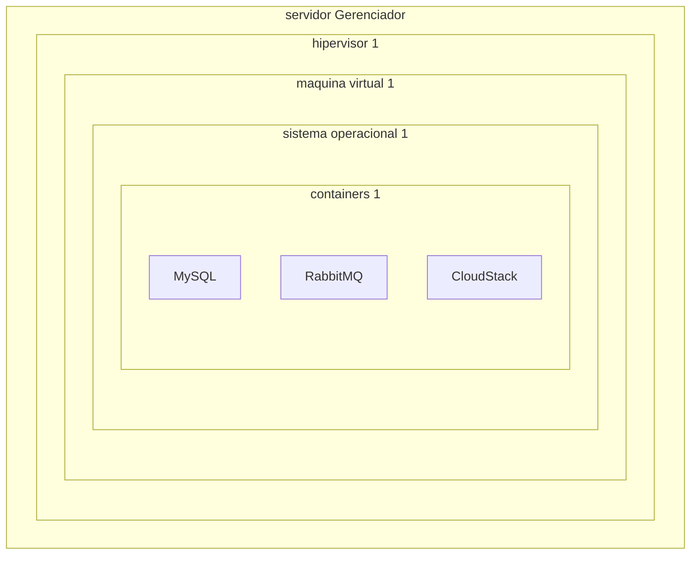
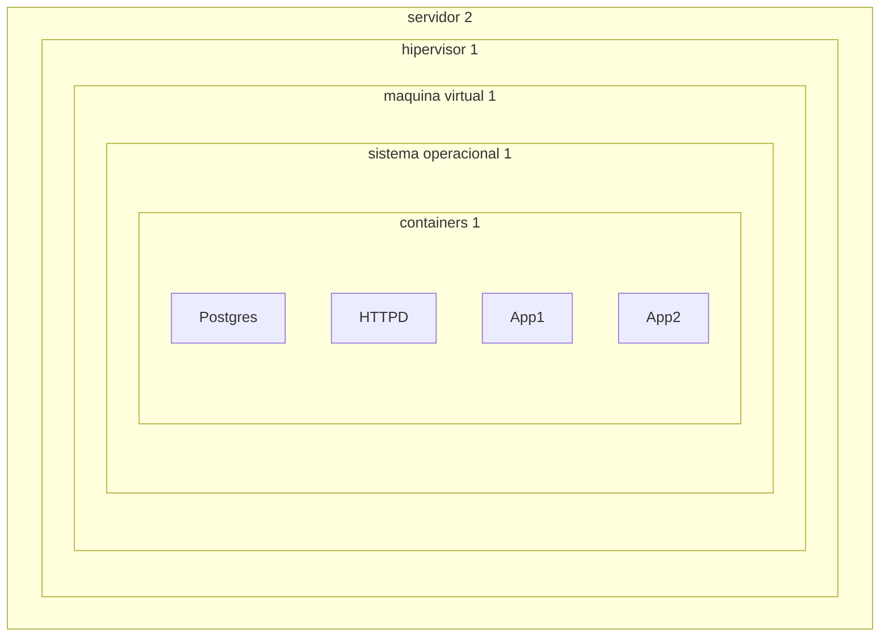
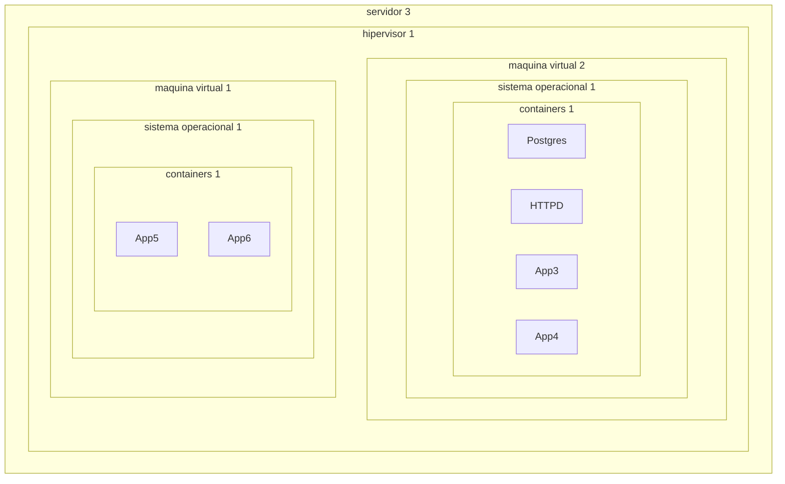

# Serviços em nuvem do **LabQS**

## Configuração do ambiente de nuvem

Um servidor gerenciador executando CloudStack onde serão criados os ambientes de serviços de computação, armazenamento e redes para os usuários finais:

Os servidores para serviços de computação e armazenamento deverão contar com hipervisores para provisionamento de máquinas virtuais e containers para isolamento de projetos e serviços:

Para o processamento em nuvem do **LabQS** iremos definir:

* **Zonas** - zonas de processamento, que a princípio será uma única, disponível no IEC, mas preparada para expansão em outros centros de processamento em diferentes prédios;
* **Pods** - um _rack_ compreendendo um _switch_ e servidores que formarão um ou mais _clusters_;
* **Cluster** - grupos de um ou mais servidores e armazenamento primário;
* **Host** - um único servidor dentro de um cluster executando um hipervisor;
* **Armazenamento primário** - recurso de armazenamento definido para um único _cluster_;
* **Armazenamento secundário** - recurso de armazenamento geral da **Zona** usado para armazenamento de _templates_, imagens de sistemas operacionais, cópias de servidores, etc.

### Sobre **Regiões**

É possível agrupar várias **Zonas** em regiões, dando alta disponibilidade e escalabilidade, o que porém vai além dos objetivos do **LabQS**.

### **Zonas**

Uma zona contém:

* Um ou mais _pods_, e cada _pod_ contendo um ou mais _clusters_ e um ou mais servidores de _armazenamento primário_;
* Um ou mais servidores _armazenament primário_ da **Zona**;
* _Armazenamento secundário_ compartilhado por todos os _pods_ da **Zona**.

A **Zona** é visível pelo usuário, que quando inicia uma máquina virtual (VM) deve escolhar a **Zona** desejada. **Zonas** podem ser públicas (visíveis para todos usuários) ou privadas (reservadas para domínios específicos).

**Hosts** na mesma zona podem ser acessados entre si sem passarem por um _firewall_. **Hosts** em **Zonas** diferentes somente podem ser acessados por meio de uma **VPN**.

Para cada **Zona** devemos decidir:

* Número de _pods_;
* Número de _clusters_ em cada _pod_;
* Número de _hosts_ em cada _cluster_;
* Quantos servidores de _armazenamento primário_ para a **Zona** e a capacidade de cada servidor;
* Quantos servidores de _armazenamento primário_ para cada _cluster_ e a capacidade de cada servidor;
* Quanto de _armazenamento secundário_ alocado para a **Zona**.

Ao criar uma **Zona** devemos configurar sua rede física, adicionar o primeiro _pod_, _cluster_, _host_, _armazenamento primário_ e _armazenamento secundário_.

### _Pods_

Um _pod_ é geralmente associado à um _rack_ e _hosts_ no mesmo _pod_ formam uma _subnet_. Um _pod_ consiste de um ou mais _clusters_ de _hosts_ e um ou mais servidores de _armazenamento primário_.

### _Clusters_

Um _cluster_ é um modo de agrupar _hosts_, consistindo de um ou mais _hosts_ e um ou mais servidores de _armazenamento primário_.

> Obs.: mesmo que seja utilizado armazenamento local e apenas um servidor, _clusters_ são organizacionalmente requisitos.

### _Hosts_

Cada servidor é um _host_, que provê recurso computacional para executar máquinas virtuais. Cada _host_ possui um hipervisor instalado (em nosso caso **Xen Project**), e proporcionam:

* CPU, memória, armazenamento, rede e conexão com internet;
* Interconexão usando rede TCP/IP de banda larga;
* Pode ter diferentes capacidades e recursos (como GPUs), mas _hosts_ dentro de um _cluster_ devem ser homogêneos.

_Hosts_ adicionais podem ser adicionados para prover mais capacidades para máquinas virtuais, e não são visíveis para os usuários finais.

Para adicionar um _host_ é preciso:

* Instalar um hipervisor;
* Assinalr um endereço IP;
* Garantir que esteja conectado ao servidor gerenciador.

### Redes

As redes em uma **Zona** dão suporte à diversos tipos de tráfegos. Para cada tipo de tráfego temos intervalos de endereços IPs designados pelo gerenciamento da **Zona**.

* **Cliente** - tráfego gerado pelas máquinas virtuais dos usuários;
* **Gerenciamento** - tráfego gerado pela comunicação entre os recursos internos da **Zona**;
* **Público** - tráfego gerado pelas máquinas virtuais ao se conectarem à internet - é utilizado _NAT_ entre a rede **Cliente** e a rede **Pública** para dar acesso via internet à máquina virtual;
* **Armazenamento** - tráfego gerado pela comunicação com _armazenamento secundário_ - uma interface de rede separada é utilizada para este tráfego.

