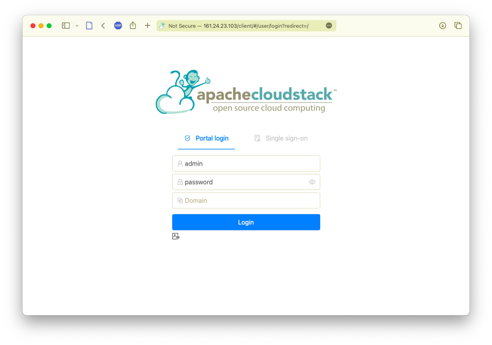

# Apache CloudStack

[Apache CloudStack] (https://docs.cloudstack.apache.org/en/latest/)

## Instalação

Definir configuração do serviço SSH nas máquinas virtuais (arquivo `/etc/xen-tools/role.d/labqs`)

```yaml
#!/bin/sh
#
#  This role setup SSH
#

prefix=$1

#
#  Source our common functions - this will let us install a Debian package.
#
if [ -e /usr/share/xen-tools/common.sh ]; then
    . /usr/share/xen-tools/common.sh
else
    echo "Installation problem"
fi

#
# Log our start
#
logMessage Script $0 starting

#
# Enable SSH root access using password
#
sed -i 's/^#PermitRootLogin\s.*$/PermitRootLogin yes/' ${prefix}/etc/ssh/sshd_config
sed -i 's/^#PasswordAuthentication\s.*$/PasswordAuthentication yes/' ${prefix}/etc/ssh/sshd_config

#
#  Log our finish
#
logMessage Script $0 finished
```

Criar máquinas virtuais:

```sh
sudo xen-create-image \
    --hostname='cloud01.labqs.ita.br' \
    --memory=2Gb \
    --vcpus=2 \
    --dir=/volumes \
    --size=100Gb \
    --ip=172.31.100.1 \
    --broadcast=172.31.255.255 \
    --netmask=255.255.0.0 \
    --gateway=172.31.0.1 \
    --nameserver=161.24.23.180 \
    --randommac \
    --bridge=xenbr0 \
    --role=labqs \
    --pygrub \
    --dist=focal \
    --password='c0r0n@' \
    --verbose

sudo xen-create-image \
    --hostname='cloud02.labqs.ita.br' \
    --memory=8Gb \
    --vcpus=2 \
    --dir=/volumes \
    --size=200Gb \
    --ip=172.31.100.2 \
    --broadcast=172.31.255.255 \
    --netmask=255.255.0.0 \
    --gateway=172.31.0.1 \
    --nameserver=161.24.23.180 \
    --randommac \
    --bridge=xenbr0 \
    --role=labqs \
    --pygrub \
    --dist=focal \
    --password='c0r0n@' \
    --verbose

sudo xen-create-image \
    --hostname='cloud03.labqs.ita.br' \
    --memory=8Gb \
    --vcpus=2 \
    --dir=/volumes \
    --size=200Gb \
    --ip=172.31.100.3 \
    --broadcast=172.31.255.255 \
    --netmask=255.255.0.0 \
    --gateway=172.31.0.1 \
    --nameserver=161.24.23.180 \
    --randommac \
    --bridge=xenbr0 \
    --role=labqs \
    --pygrub \
    --dist=focal \
    --password='c0r0n@' \
    --verbose

sudo xl create /etc/xen/cloud01.labqs.ita.br.cfg

sudo xl create /etc/xen/cloud02.labqs.ita.br.cfg

sudo xl create /etc/xen/cloud03.labqs.ita.br.cfg
```

### Registrar auto-login:

```sh
ssh root@172.31.100.1 'mkdir -p ~/.ssh'
cat ~/.ssh/id_ed25519.pub | ssh root@172.31.100.1 'cat > .ssh/authorized_keys'

ssh root@172.31.100.2 'mkdir -p ~/.ssh'
cat ~/.ssh/id_ed25519.pub | ssh root@172.31.100.2 'cat > .ssh/authorized_keys'

ssh root@172.31.100.3 'mkdir -p ~/.ssh'
cat ~/.ssh/id_ed25519.pub | ssh root@172.31.100.3 'cat > .ssh/authorized_keys'
```

```sh
```

## Acessar a máquina virtual e instalar CloudStack

### Configurar rede

Configurar rede (verificar nome/IP da interface) em `/etc/netplan/01-netcfg.yaml`) e repetir para os servidores de armazenamento

```yaml
network:
  version: 2
  renderer: networkd

  ethernets:
    eth0:
      dhcp4: false
      dhcp6: false
      optional: true

  bridges:
    cloudbr0:
      addresses:
      - "172.31.100.1/16"
      interfaces:
      - eth0
      dhcp4: false
      dhcp6: false
      routes:
      - to: default
        via: 172.31.0.1
      nameservers:
        addresses:
        - 161.24.23.199
        - 161.24.23.180
      parameters:
        stp: false
        forward-delay: 0
```

```sh
    netplan generate

    netplan apply

    reboot
```

Repetir para `172.31.100.2` e `172.31.100.3` com os respectivos IPs.

### Servidor de gerenciamento

```sh

ssh root@172.31.100.1

    apt-get update && apt-get upgrade -y

    apt-get install -y chrony wget gnupg curl openjdk-11-jdk mysql-server nfs-kernel-server quota

    timedatectl set-timezone America/Sao_Paulo

    mkdir -p /etc/apt/keyrings
    
    wget -O- http://download.cloudstack.org/release.asc | gpg --dearmor | sudo tee /etc/apt/keyrings/cloudstack.gpg > /dev/null

    echo deb [signed-by=/etc/apt/keyrings/cloudstack.gpg] http://download.cloudstack.org/ubuntu focal 4.17 > /etc/apt/sources.list.d/cloudstack.list
    
    apt-get update

    apt-get install --yes cloudstack-management
```

Gerar chaves para acessar as demais máquinas virtuais a partir do servidor de gerenciamento:

```sh
    ssh-keygen -t ed25519 -C 'labqs@ita.br'

    cat ~/.ssh/id_ed25519.pub | ssh root@172.31.100.1 'cat >> .ssh/authorized_keys'

    cat ~/.ssh/id_ed25519.pub | ssh root@172.31.100.2 'cat >> .ssh/authorized_keys'

    cat ~/.ssh/id_ed25519.pub | ssh root@172.31.100.3 'cat >> .ssh/authorized_keys'
```

Editar configurações do banco de dados no arquivo `/etc/mysql/conf.d/cloudstack.cnf` para o servidor de gerenciamento

```sh
    vi /etc/mysql/conf.d/cloudstack.cnf
```

```ini
[mysqld]
server-id=1
sql-mode="STRICT_TRANS_TABLES,NO_ENGINE_SUBSTITUTION,ERROR_FOR_DIVISION_BY_ZERO,NO_ZERO_DATE,NO_ZERO_IN_DATE,NO_ENGINE_SUBSTITUTION"
innodb_rollback_on_timeout=1
innodb_lock_wait_timeout=600
max_connections=1000
log-bin=mysql-bin
binlog-format = 'ROW'
default-authentication-plugin=mysql_native_password
```

Re-iniciar serviço de banco de dados:

```sh
    systemctl restart mysql.service
```

Criar banco de dados:

```sh
    cloudstack-setup-databases maint:'c0r0n@'@localhost --deploy-as=root -m 'c0r0n@' -k 'c0r0n@' -i 127.0.0.1
```

Atualizar nome do `host``

```sh
vi /etc/hosts

    127.0.0.1    localhost localhost.localdomain localhost4 localhost4.localdomain4
    172.31.100.1 cloud01.labqs.ita.br cloud01

vi /etc/hostname

    cloud01

systemctl restart systemd-networkd
```

Configurar agente:


```sh
touch /etc/cloudstack/agent/cloud.jks

touch /etc/cloudstack/agent/uefi.properties
```

Gerar **UUID** (usar `uuidgen` para obter uma chave):

> Ou esperar a **UUID** gerada durante a iniciação dos serviços **cloudstack** mais abaixo

```sh
vi /etc/cloudstack/agent/agent.properties
```

```ini
. . .
uuid=
. . .
```

Iniciar os serviços do **cloudstack** e inspecionar os _logs_ para verificar quando o serviço terminar de configurar o banco de dados:

```sh
cloudstack-setup-management

tail -f /var/log/cloudstack/management/management-server.log
```

#### Servidores de armazenamento e execução

Instalar os servidores de armazenamento (`172.31.100.2` e `172.31.100.3`)

```sh
ssh root@172.31.100.1

    apt-get update && apt-get upgrade -y

    reboot

    apt-get install -y wget gnupg curl openjdk-11-jdk nfs-kernel-server quota

    mkdir -p /etc/apt/keyrings
    
    wget -O- http://download.cloudstack.org/release.asc | gpg --dearmor | sudo tee /etc/apt/keyrings/cloudstack.gpg > /dev/null

    echo deb [signed-by=/etc/apt/keyrings/cloudstack.gpg] http://download.cloudstack.org/ubuntu focal 4.17 > /etc/apt/sources.list.d/cloudstack.list

    apt-get update
```

Instalar os servidores de trabalho (`172.31.100.2` e `172.31.100.3`)

```sh
    apt-get install -y cloudstack-agent

    systemctl stop cloudstack-agent.service

    touch /etc/cloudstack/agent/cloud.jks

    touch /etc/cloudstack/agent/uefi.properties

    systemctl start cloudstack-agent.service
```

Configurar armazenamento (`172.31.100.2`)

```sh
    mkdir -p /export/primary /export/secondary

    exportfs -a

    sed -i -e 's/^RPCMOUNTDOPTS="--manage-gids"$/RPCMOUNTDOPTS="-p 892 --manage-gids"/g' /etc/default/nfs-kernel-server

    sed -i -e 's/^STATDOPTS=$/STATDOPTS="--port 662 --outgoing-port 2020"/g' /etc/default/nfs-common

    echo "NEED_STATD=yes" >> /etc/default/nfs-common

    sed -i -e 's/^RPCRQUOTADOPTS=$/RPCRQUOTADOPTS="-p 875"/g' /etc/default/quota

    systemctl restart nfs-kernel-server
```


## Exportar portas do servidor de gerenciamento

No _host_ expor as seguintes portas:


# Configurar host KVM após instalar Agent CloudStack

## Mapear porta SSH

sudo iptables -t nat -A PREROUTING -i enp6s0 -p tcp -m tcp --dport 22 -j DNAT --to-destination 161.24.23.95:2222

## Liberar SSH usuário root

Arquivo `/etc/ssh/sshd_config`

PermitRootLogin yes

## Senha para usuário root

sudo usermod --password $(echo s3cr37 | openssl passwd -1 -stdin) 


```sh
sudo iptables -t nat -A PREROUTING -i enp2s0f0 -p tcp -m tcp --dport 80 -j DNAT --to-destination 172.31.100.1:8080

sudo iptables -t nat -A PREROUTING -i enp2s0f0 -p tcp -m tcp --dport 443 -j DNAT --to-destination 172.31.100.1:8443

sudo iptables -t nat -A PREROUTING -i enp2s0f0 -p tcp -m tcp --dport 8250 -j DNAT --to-destination 172.31.100.1:8250

sudo iptables -t nat -A PREROUTING -i enp2s0f0 -p tcp -m tcp --dport 9090 -j DNAT --to-destination 172.31.100.1:9090

sudo iptables-save | sudo tee /etc/iptables/rules.v4

sudo ip6tables-save | sudo tee /etc/iptables/rules.v6
```

Opcional, expor a porta do serviço **MySQL**

```sh
sudo iptables -t nat -A PREROUTING -i enp2s0f0 -p tcp -m tcp --dport 3306 -j DNAT --to-destination 172.31.100.1:3306
```


## Login

Primeiro login no sistema (_usuário_: *admin*, _senha_: *password*)



## Se for necessário acessar o console da máquina virtual

```sh
sudo xl console cloud01.labqs.ita.br
```

## Destruir experimento

### Excluir máquina virtual

```sh
sudo xl destroy cloud01.labqs.ita.br

sudo xl destroy cloud02.labqs.ita.br

sudo xl destroy cloud03.labqs.ita.br

sudo rm /etc/xen/cloud01.labqs.ita.br.cfg

sudo rm /etc/xen/cloud02.labqs.ita.br.cfg

sudo rm /etc/xen/cloud03.labqs.ita.br.cfg

sudo rm -rf /volumes/domains/cloud01.labqs.ita.br

sudo rm -rf /volumes/domains/cloud02.labqs.ita.br

sudo rm -rf /volumes/domains/cloud03.labqs.ita.br
```

### Desfazer as rotas

Listar as rotas:

```sh
sudo iptables -L -t nat --line-numbers
```

Apagar cada uma pelo número da linha (*obs*.: _ao excluir as rotas são renomeradas, então começar de trás para frente_):

```sh
sudo iptables -t nat -D PREROUTING 4
sudo iptables -t nat -D PREROUTING 3
sudo iptables -t nat -D PREROUTING 2
sudo iptables -t nat -D PREROUTING 1
```
