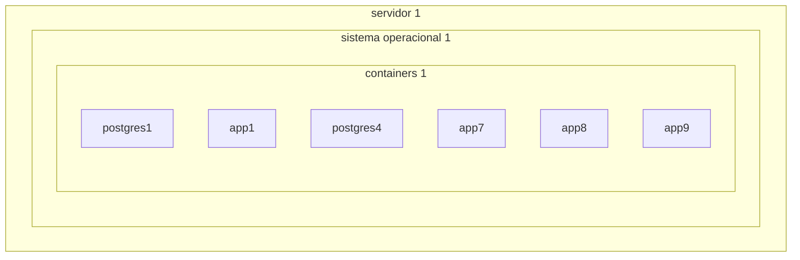
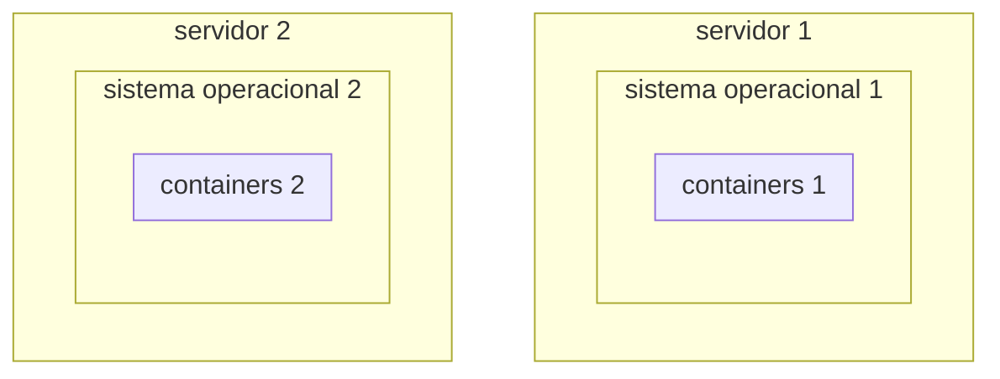
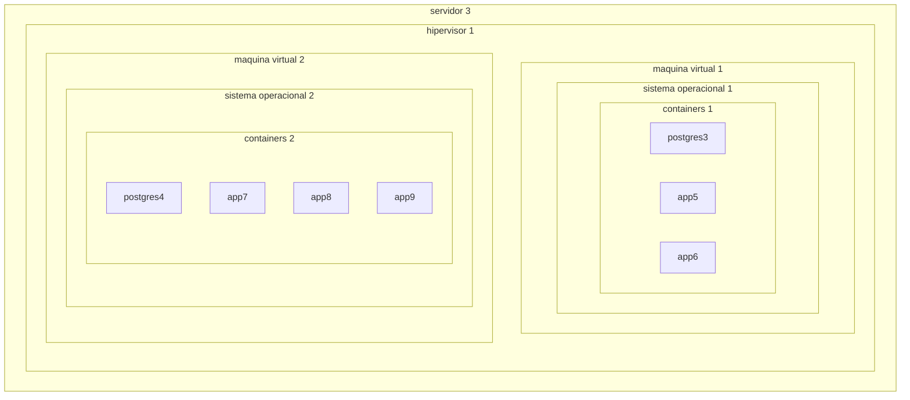
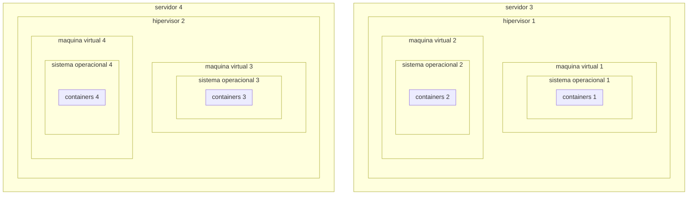

# Xen Project

## Configuração atual

Atualmente servidores discretos possuem containers que isolam as aplicações:



<div style="page-break-after: always;"></div>

O crescimento acontece de modo horizontal, adicionando-se mais servidores:



<div style="page-break-after: always;"></div>

## Proposta

Utilizando um hipervisor podemos criar ambientes de pesquisa, desenvolvimento, simulações e testes discretos dentro do mesmo servidor



<div style="page-break-after: always;"></div>

Permitindo crescimento horizontal com a adição de servidores, e vertical usando mais a capacidade instalada de cada servidor:



## Pré instalação Ubuntu

### Ajustar `hosts`

No arquivo `/etc/hosts`, eliminar linha

```
127.0.1.1 <nome do host>
```

### Atualizar sistema

```bash
sudo apt update -y && apt upgrade -y
```
### Criar usuários

```bash
sudo adduser --disabled-password --gecos "" gpes
sudo usermod --password $(echo c0r0n@ | openssl passwd -1 -stdin) gpes
sudo usermod -a -G sudo gpes
```

#### Autorizar para sudo

```bash
echo "gpes ALL=(ALL:ALL) ALL" | sudo tee /etc/sudoers.d/gpes
```

## Instalar Xen Hypervisor

```bash
sudo apt-get install -y xen-hypervisor-amd64
sudo reboot
```

### Configurar memória Xen

Arquivo `/etc/default/grub.d/xen.cfg`

Opção com 4Gb:

```ini
GRUB_CMDLINE_XEN_DEFAULT="dom0_mem=4096M,max:4096M"
```

Opção com 10Gb:

```ini
GRUB_CMDLINE_XEN_DEFAULT="dom0_mem=10794M,max:10794M"
```

```bash
sudo update-grub
sudo reboot
```

### Xen-Tools

```bash
sudo apt install -y xen-tools
```

## Configurar redes

Instalar utilitários

```bash
sudo apt install -y iptables-persistent
```

### Gateway interno

Arquivo `/etc/sysctl.conf`, remover o comentário da linha:

```ini
net.ipv4.ip_forward = 1
net.ipv4.conf.enp2s0.proxy_arp = 1
```

Atualizar com o comando

```bash
sudo sysctl -p
```

Adicionar *NAT* _forwarding_ evitando que **systemd-resolved** entre em conflito com o mapeamento (opção *! -o lo*)

```bash
sudo iptables ! -o lo -t nat -A POSTROUTING -j MASQUERADE
sudo dpkg-reconfigure iptables-persistent
```


 #### Excluir regras (caso deseje reverter)

Listar a regra

 ```bash
 sudo iptables -L -t nat --line-numbers
 ```

Excluir pelo número da linha

```bash
sudo iptables -t nat -D POSTROUTING 1
```

<div style="page-break-after: always;"></div>

## Habilitar ssh na VM

Arquivo `/etc/xen-tools/role.d/labqs-sshd` para habilitar acesso *SSH* via porta 2222 para usuário *root*

```bash
#!/bin/sh
#
#  This role enable remote SSH access via port 2222
#

prefix=$1

#
#  Source our common functions - this will let us install a Debian package.
#
if [ -e /usr/share/xen-tools/common.sh ]; then
    . /usr/share/xen-tools/common.sh
else
    echo "Installation problem"
fi

#
# Log our start
#
logMessage Script $0 starting

#
# Enable SSH access on port 2222 using password
#
sed -i 's/^#Port\s.*$/Port 2222/' ${prefix}/etc/ssh/sshd_config
sed -i 's/^#PermitRootLogin\s.*$/PermitRootLogin yes/' ${prefix}/etc/ssh/sshd_config
sed -i 's/^#PasswordAuthentication\s.*$/PasswordAuthentication yes/' ${prefix}/etc/ssh/sshd_config

#
#  Log our finish
#
logMessage Script $0 finished
```

<div style="page-break-after: always;"></div>

## Criar VMs

```bash
sudo xen-create-image \
	--hostname='c1.labqs.ita.br' \
	--memory=1gb \
	--vcpus=2 \
	--lvm=ubuntu-vg  \
    --size=20Gb \
    --ip=172.31.100.1 \
    --netmask=172.31.0.0 \
    --broadcast=172.31.255.255 \
    --netmask=255.255.0.0 \
    --gateway=172.31.0.1 \
    --nameserver=161.24.23.180 \
	--randommac \
    --bridge=xenbr0 \
    --role=labqs-sshd \
	--pygrub \
	--dist=bionic \
    --password='c0r0n@' \
    --verbose
```


### Extender o volume lógico

```bash
sudo lvextend --size +1G /dev/ubuntu-vg/c1-disk
```


### Iniciar VM

```bash
sudo xl create /etc/xen/labqs-c1.cfg
```

### Acessar a VM

```bash
ssh -p 2222 root@labqs-c1
```

### Acessar a VM via console

```bash
sudo xl console labqs-c1
```

### Recriar VM

```bash
sudo xl destroy labqs-c1
sudo xl create /etc/xen/labqs-c1.cfg
```
