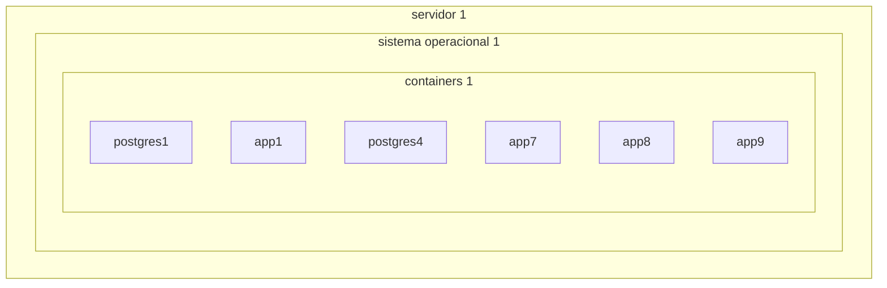
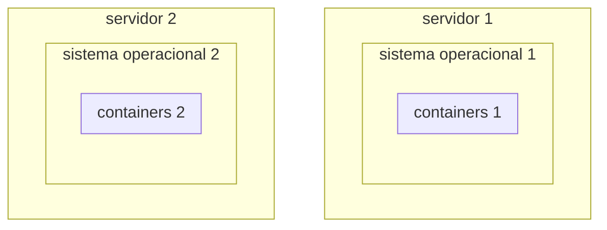
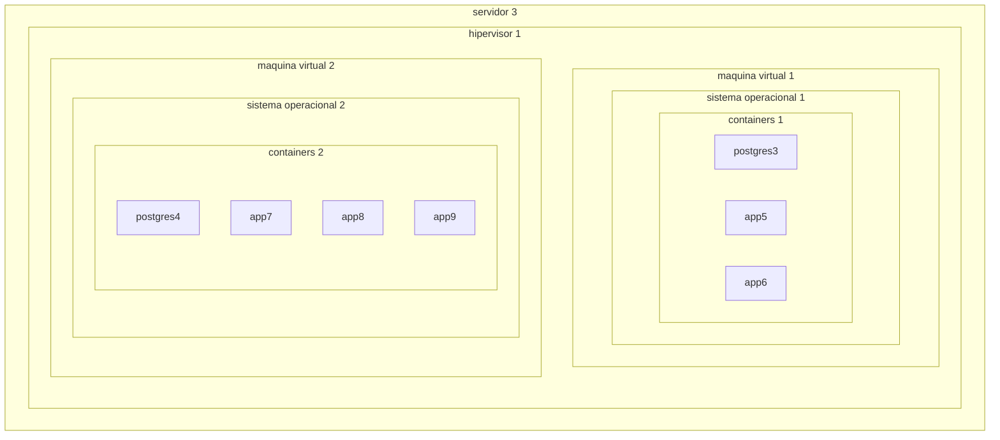
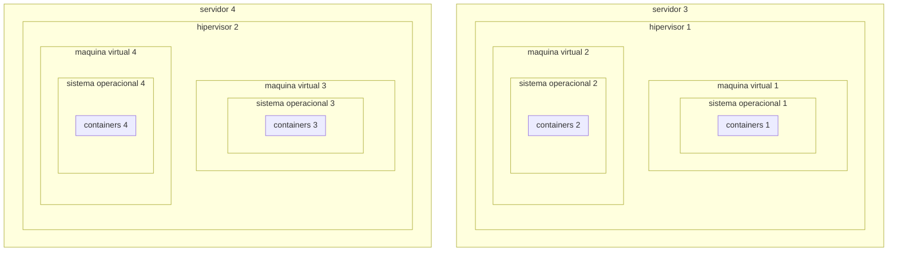
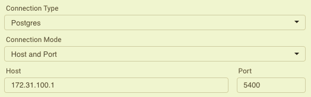
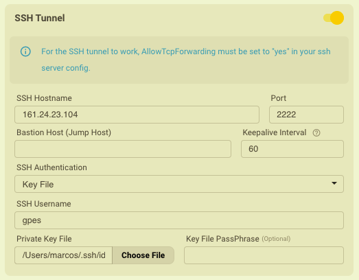
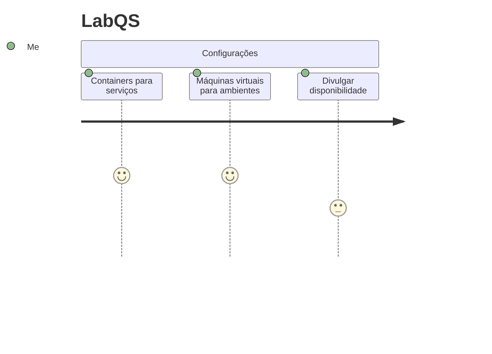
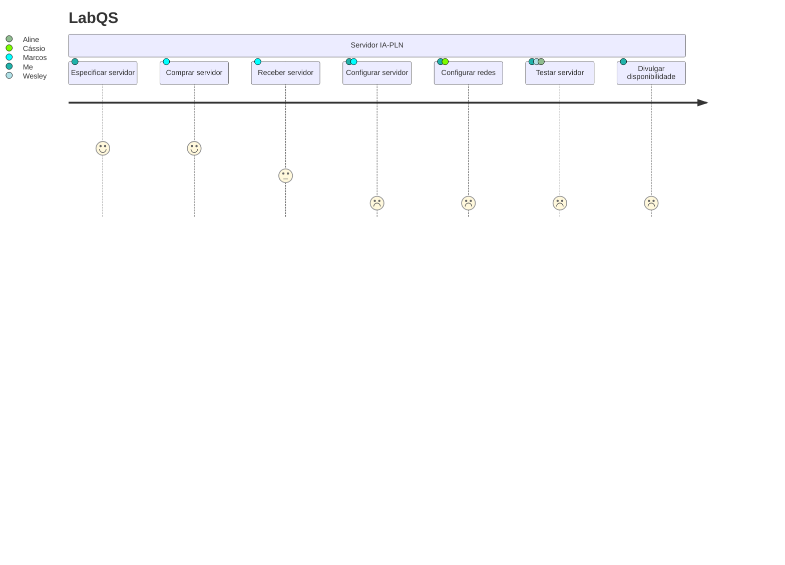
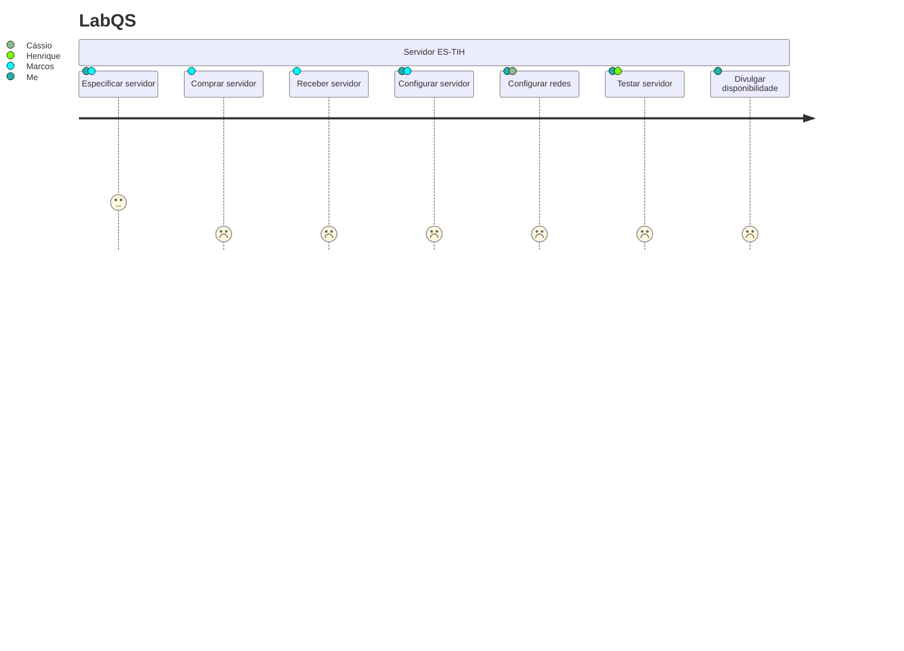

# Xen Project

## Configuração atual

Atualmente servidores discretos possuem containers que isolam as aplicações:



<div style="page-break-after: always;"></div>

O crescimento acontece de modo horizontal, adicionando-se mais servidores:



<div style="page-break-after: always;"></div>

## Proposta

Utilizando um hipervisor podemos criar ambientes de pesquisa, desenvolvimento, simulações e testes discretos dentro do mesmo servidor



<div style="page-break-after: always;"></div>

Permitindo crescimento horizontal com a adição de servidores, e vertical usando mais a capacidade instalada de cada servidor:



# Configuração do ambiente

## Pré instalação Ubuntu

### Ajustar `hosts`

No arquivo `/etc/hosts`, eliminar linha

```
127.0.1.1 <nome do host>
```

### Atualizar sistema

```sh
sudo apt update -y && apt upgrade -y
```

<div style="page-break-after: always;"></div>

### Criar usuários

```sh
sudo adduser --disabled-password --gecos "" gpes
sudo usermod --password $(echo c0r0n@ | openssl passwd -1 -stdin) gpes
```

#### Autorizar para sudo

```sh
echo "gpes ALL=(ALL:ALL) ALL" | sudo tee /etc/sudoers.d/gpes
```

## Instalar Xen Hypervisor

```sh
sudo apt-get install -y xen-hypervisor-amd64
sudo reboot
```

### Configurar memória Xen

Arquivo `/etc/default/grub.d/xen.cfg`

Opção com 4Gb:

```ini
GRUB_CMDLINE_XEN_DEFAULT="dom0_mem=4096M,max:4096M"
```

Opção com 16Gb:

```ini
GRUB_CMDLINE_XEN_DEFAULT="dom0_mem=16384M,max=16384M"
```

```sh
sudo update-grub
sudo reboot
```

### Xen-Tools

```sh
sudo apt install -y xen-tools
```

<div style="page-break-after: always;"></div>

## Configurar redes

Instalar utilitários

```sh
sudo apt install -y iptables-persistent
```

### Gateway interno

Arquivo `/etc/sysctl.conf`, remover o comentário da linha:

```ini
net.ipv4.ip_forward = 1
```

Atualizar com o comando

```sh
sudo sysctl -p
```

Adicionar *NAT* _forwarding_ evitando que **systemd-resolved** entre em conflito com o mapeamento (opção *! -o lo*)

```sh
sudo iptables ! -o lo -t nat -A POSTROUTING -j MASQUERADE
sudo dpkg-reconfigure iptables-persistent
```


 #### Excluir regras (caso deseje reverter)

Listar a regra

 ```sh
 sudo iptables -L -t nat --line-numbers
 ```

Excluir pelo número da linha

```sh
sudo iptables -t nat -D POSTROUTING 1
```

<div style="page-break-after: always;"></div>

## Habilitar ssh na Máquina Virtual

Arquivo `/etc/xen-tools/role.d/labqs-sshd` para habilitar acesso *SSH* via porta 2222 para usuário *root* (modificar para torná-lo executável):

```sh
#!/bin/sh
#
#  This role enable remote SSH access via port 2222
#

prefix=$1

#
#  Source our common functions - this will let us install a Debian package.
#
if [ -e /usr/share/xen-tools/common.sh ]; then
    . /usr/share/xen-tools/common.sh
else
    echo "Installation problem"
fi

#
# Log our start
#
logMessage Script $0 starting

#
# Enable SSH access on port 2222 using password
#
sed -i 's/^#Port\s.*$/Port 2222/' ${prefix}/etc/ssh/sshd_config
sed -i 's/^#PermitRootLogin\s.*$/PermitRootLogin yes/' ${prefix}/etc/ssh/sshd_config
sed -i 's/^#PasswordAuthentication\s.*$/PasswordAuthentication yes/' ${prefix}/etc/ssh/sshd_config

#
#  Log our finish
#
logMessage Script $0 finished
```

<div style="page-break-after: always;"></div>

## Criar Máquinas Virtuais

```sh
sudo xen-create-image \
	--hostname='c1.labqs.ita.br' \
	--memory=1gb \
	--vcpus=2 \
	--lvm=ubuntu-vg  \
    --size=20Gb \
    --ip=172.31.100.1 \
    --netmask=172.31.0.0 \
    --broadcast=172.31.255.255 \
    --netmask=255.255.0.0 \
    --gateway=172.31.0.1 \
    --nameserver=161.24.23.180 \
	--randommac \
    --bridge=xenbr0 \
    --role=labqs-sshd \
	--pygrub \
	--dist=bionic \
    --password='c0r0n@' \
    --verbose
```


### Extender o volume lógico

Caso necessário é possível extender o volume alocado para a Máquina Virtual:

```sh
sudo lvextend --size +1G /dev/ubuntu-vg/c1.labqs.ita.br-disk
```


### Iniciar a Máquina Virtual

```sh
sudo xl create /etc/xen/c1.labqs.ita.br.cfg
```

### Acessar a Máquina Virtual

```sh
ssh -p 2222 root@172.31.100.1
```

> **OBSERVAÇÃO** - pode ser necessário apagar uma entrada anterior para a máquina virtual no arquivo `~/.ssh/know_hosts` caso ela tenha sido recriada.

<div style="page-break-after: always;"></div>

### Acessar a Máquina Virtual via console

```sh
sudo xl console c1.labqs.ita.br
```

### Acessar a máquina virtual externamente

É possível acessar a máquina virtual externamente por meio de uma porta do _host_, porém caso deseje acessar uma porta específica (como a porta **80** para aplicações internet), então a máquina virtual deve ter um endereço **IP** próprio para ser exposta à internet.

No primeiro caso (_acesso à porta **80** de uma aplicação internet rodando na máquina virtual_), a porta 80 do _host_ poderá ser mapeada diretamente para a máquina virtual:

#### Exemplo de roteamento de porta autorizada para a **DMZ**

```sh
sudo iptables -t nat -A PREROUTING -i enp2s0f0 -p tcp -m tcp --dport 80 -j DNAT --to-destination 172.31.100.1:80
sudo dpkg-reconfigure iptables-persistent
```

Outro caso é o de mapear dois serviços distintos que utilizam a mesma porta em máquinas virtuais diferentes. Vamos supor que temos dois serviços **Postgres** instalados em duas máquinas virtuais diferentes, e ambos utilizam a mesma porta **5400**. O primeiro poderá usar a porta **5400** do _host_, porém o segundo deverá usar uma porta diferente.

#### Exemplo de roteamento de porta não autorizada para a **DMZ**

Do mesmo modo que a porta autorizada, é preciso criar a rota:

```sh
sudo iptables -t nat -A PREROUTING -i enp2s0f0 -p tcp -m tcp --dport 5400 -j DNAT --to-destination 172.31.100.1:5400
sudo dpkg-reconfigure iptables-persistent
```

Vamos usar como modelo a instalação do **Postgres** no container **Docker**, que está configurado deste modo:

```yaml
    ports:
      - '5400:5432'
```

<div style="page-break-after: always;"></div>

O endereço IP é o definido para a máquina virtual (extraído do _script_ de criação da máquina virtual logo mais acima):

```sh
    --ip=172.31.100.1 \
```

Em seguida podemos acessar o serviço **Postgres** via **VPN** acessando a porta `5400`:



Devemos também informar uma conexão com o _host_ via túnel _SSH_ com as credenciais da **VPN** (no exemplo abaixo estamos usando um arquivo com chave _pública_/_privada_):



<div style="page-break-after: always;"></div>

#### Exemplo de roteamento de porta não autorizada para a **DMZ** para um segundo servidor **Postgres** na mesma porta

Novamente é preciso criar uma rota, só que desta vez mapeada para outra porta no _host_ ao invés de usar a mesma porta da máquina virtual:

```sh
sudo iptables -t nat -A PREROUTING -i enp2s0f0 -p tcp -m tcp --dport 5300 -j DNAT --to-destination 172.31.100.1:5400
sudo dpkg-reconfigure iptables-persistent
```

Os procedimentos para conexão serão os mesmos, só que desta vez utilizando a porta **5300** ao invés da **5400** utilizada no exemplo anterior.

## Ajustes para executar o ambiente LabQS sem certificados digitais

### Configurar redirect HTTP

Observar que a configuração dos servidores **HTTPD** possuem os seguintes parâmetros:

```xml
<VirtualHost *:80>
  
    ServerName ${LAB_DOMAIN}

    Redirect permanent / https://${LAB_DOMAIN}/

</VirtualHost>
```

A variável `$LAB_DOMAIN` é geralmente iniciada com o domínio registrado no **DNS** para o servidor em questão, o que pode causar um redirect para um dos servidores do **LabQS** caso a configuração dos novos servidores não seja modificada corretamente.


### Recriar a Máquina Virtual

```sh
sudo xl destroy c1.labqs.ita.br
sudo xl create /etc/xen/c1.labqs.ita.br.cfg
```

### Remover a Máquina Virtual

```sh
sudo xl destroy c1.labqs.ita.br
sudo rm /etc/xen/c1.labqs.ita.br.cfg
sudo lvremove /dev/ubuntu-vg/c1.labqs.ita.br-swap --yes
sudo lvremove /dev/ubuntu-vg/c1.labqs.ita.br-disk --yes
```

Caso o volume acuse que está em uso basta remove-lo da lista do sistema operacional (um dos dois):

```sh
sudo umount /dev/mapper/ubuntu--vg-c1.labqs.ita.br--disk
sudo lvremove /dev/ubuntu-vg/c1.labqs.ita.br-disk --yes
```

<div style="page-break-after: always;"></div>

# TODO LabQS



<div style="page-break-after: always;"></div>

# TODO Servidor IA-PLN



<div style="page-break-after: always;"></div>

# TODO Servidor ES-TIH


